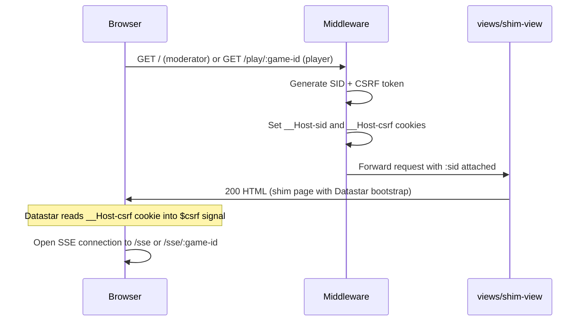
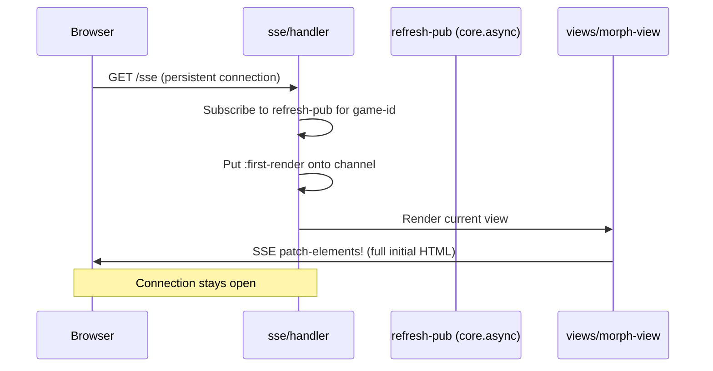
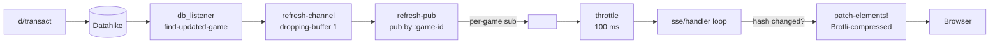
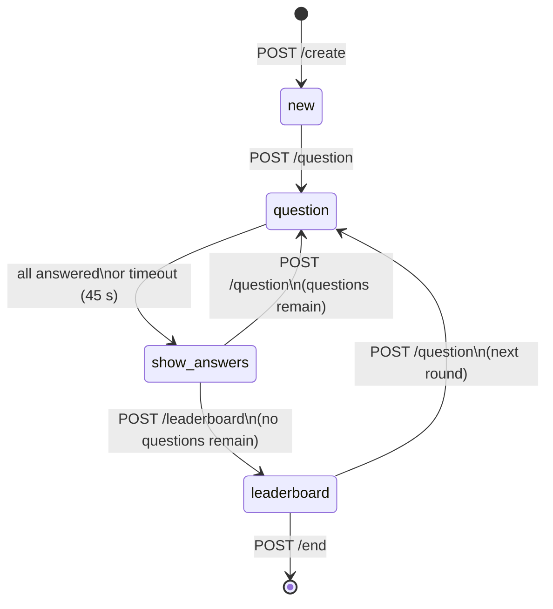
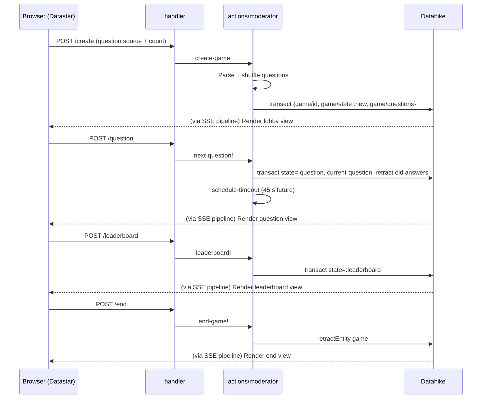
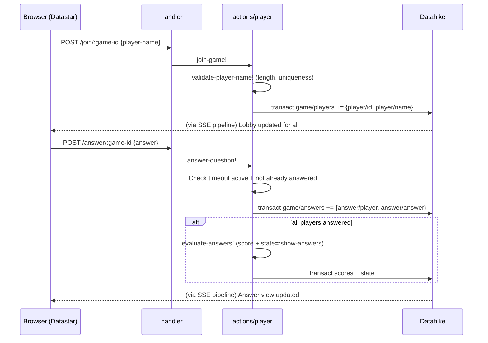
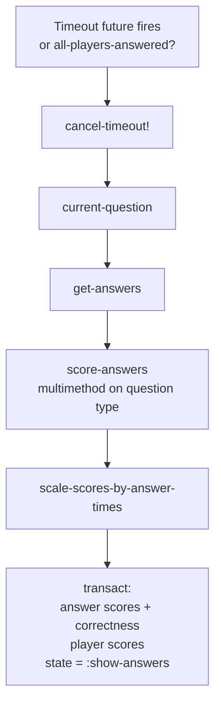
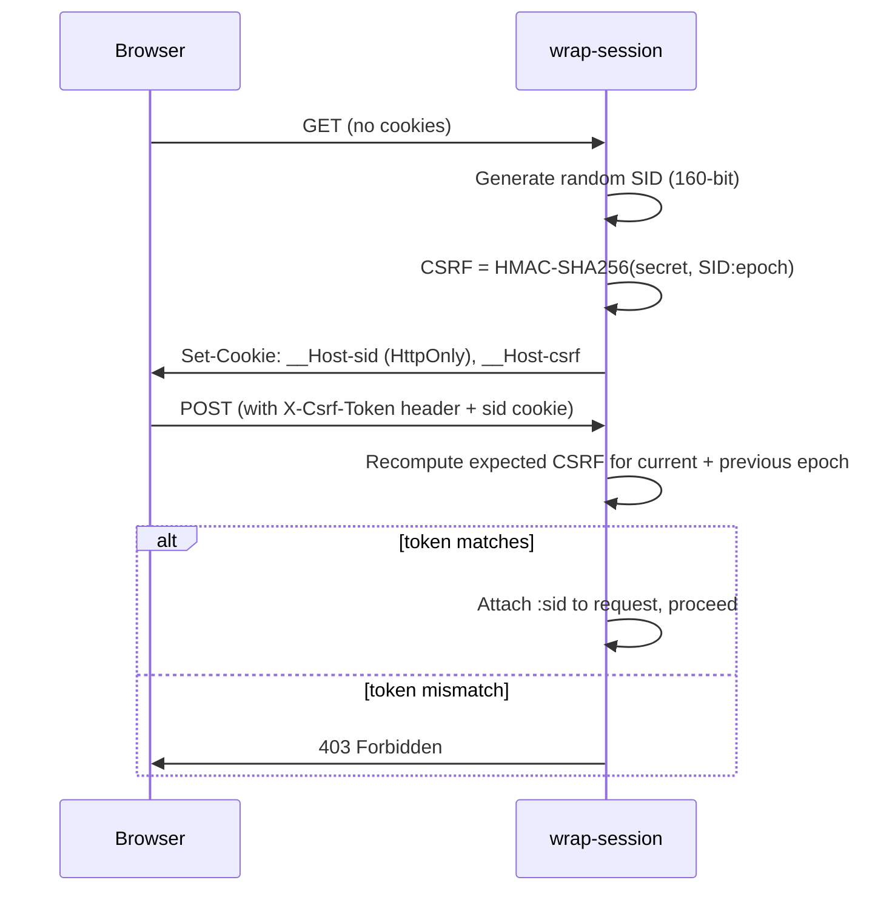

# Data flow

## Overview

The application is server-driven: the server owns all state (in Datahike) and pushes HTML patches to connected clients via Server-Sent Events (SSE). Clients send actions via HTTP POST; the server updates the database; a transaction listener fans those changes out to the relevant SSE streams.

## Roles

- **Moderator** — the quiz host. Identified by their session ID, which doubles as the game ID.
- **Player** — a participant. Identified by their session ID; associated with a game via the game ID in the URL path.

---

## 1. Initial page load

The shim page contains no game content — just the Datastar runtime and a `data-on:load` attribute that immediately opens the SSE connection. All content arrives via SSE.

---

## 2. SSE connection and first render

The SSE handler keeps a virtual thread looping on a throttled channel (≤ 1 update per 100 ms). It hashes the rendered HTML and only sends a patch when the hash changes.

---

## 3. Real-time update pipeline

Every database transaction triggers this pipeline, delivering UI updates to all connected clients for the affected game.

---

## 4. Game state machine

---

## 5. Moderator actions

---

## 6. Player actions

---

## 7. Answer evaluation

Triggered either when all players answer or when the 45-second timeout fires.

---

## 8. Session and CSRF flow

