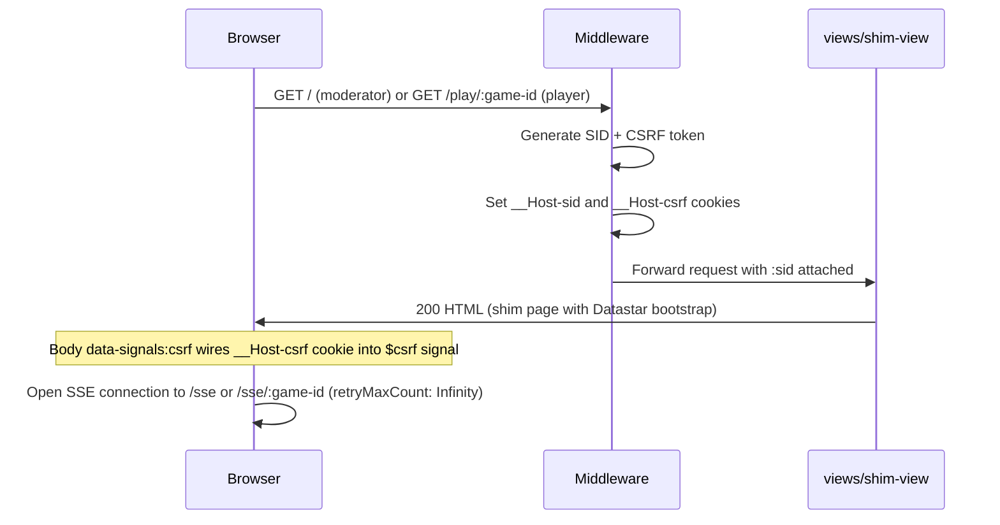
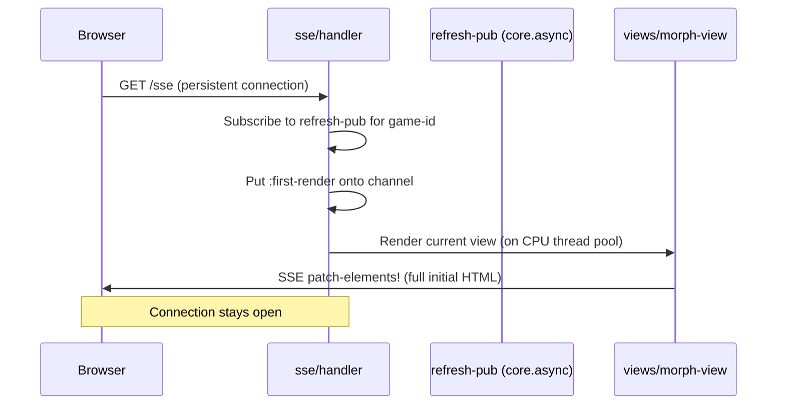
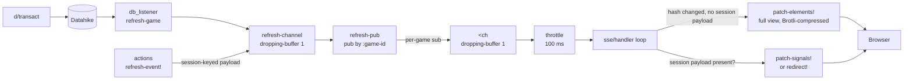
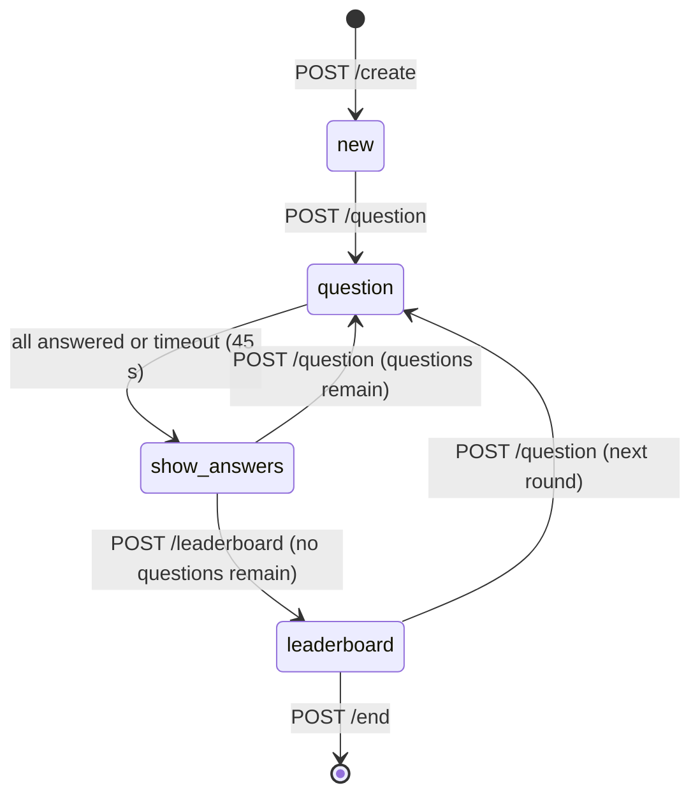
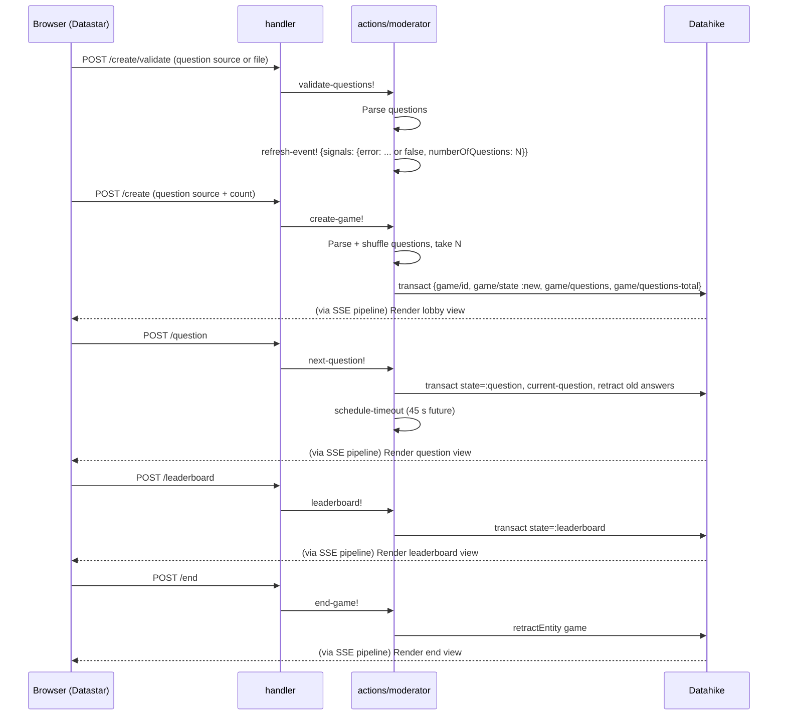
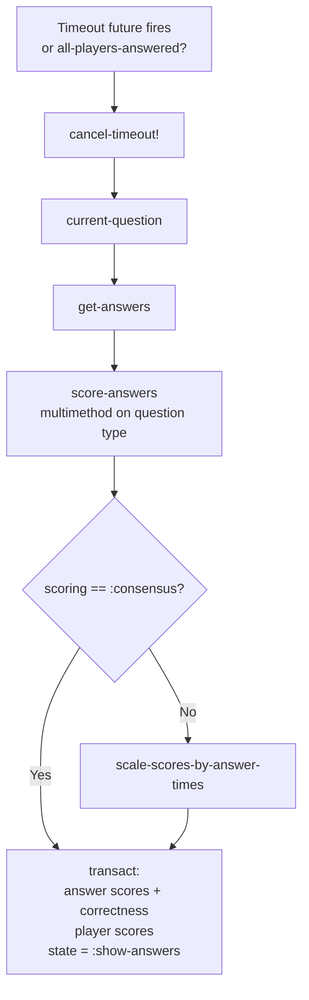
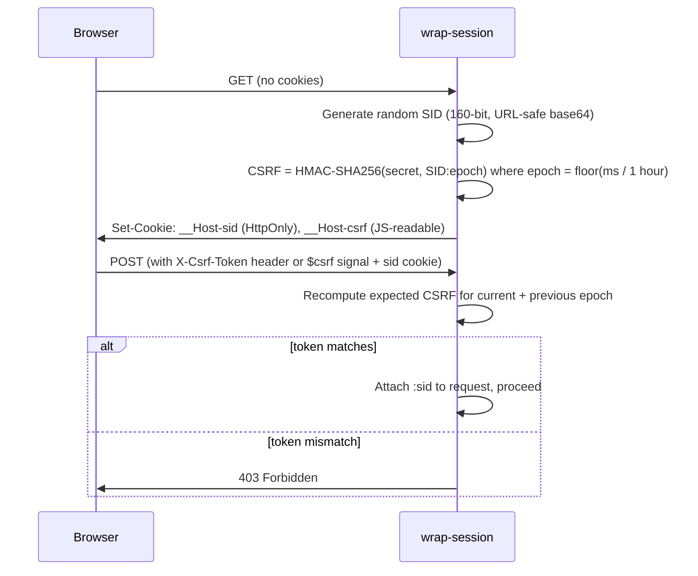

# Data flow

## Design summary

localquiz is a **server-driven, real-time multiplayer quiz**. The server owns all state (Datahike) and pushes HTML patches to connected clients via SSE. Clients never manage view state — they only send HTTP POST actions and receive SSE events.

**Two roles:**

- **Moderator** — identified by session ID, which doubles as the game ID. Controls quiz progression.
- **Player** — identified by session ID; associated with a game via the game ID in the URL path.

**Four data paths:**

1. **Initial page load** — server issues a session cookie and CSRF token, returns a minimal shim HTML page with the Datastar runtime. The shim immediately opens an SSE connection; all UI content arrives via that stream.

2. **SSE view-update path** — every Datahike transaction triggers `db_listener`, which identifies the affected game and publishes its ID onto `refresh-channel`. Each connected SSE handler receives the event (via `refresh-pub`), re-renders the **full view** on a CPU thread pool, hashes it, and sends the full HTML via `patch-elements!` if the hash changed. Datastar morphs it into the existing DOM client-side (fat-morph approach — no server-side diffing or partial fragments).

3. **Direct signal/redirect path** — actions that need per-session feedback (validation errors, redirect after leaving) call `refresh-event!`, which puts an event with a session-keyed payload directly onto `refresh-channel`. The SSE handler detects the session key, sends only signals or a redirect to that client, and skips the view re-render.

4. **State machine** — the game progresses through `:new → :question → :show-answers → :leaderboard` and back (or terminates). State transitions are triggered by moderator POST actions; the `:show-answers` transition fires automatically when all players answer or the 45-second timeout expires.

**Brotli gate:** `wrap-blocker` rejects all requests that do not accept Brotli (`br`) with HTTP 406.

**POST responses:** all POST action handlers return HTTP 204 (No Content). The actual view update is always delivered via SSE.

## Roles

- **Moderator** — the quiz host. Identified by their session ID, which doubles as the game ID.
- **Player** — a participant. Identified by their session ID; associated with a game via the game ID in the URL path.

---

## 1. Initial page load

The shim page contains no game content — just the Datastar runtime and a `data-init` attribute that immediately opens the SSE connection. All content arrives via SSE. The `$csrf` signal is initialised from the `__Host-csrf` cookie by a JS expression on the `<body>` element. The connection is also re-opened on the `online` window event.

---

## 2. SSE connection and first render

The SSE handler keeps a virtual thread looping on a throttled channel (≤ 1 update per 100 ms). View rendering is offloaded to a CPU thread pool. The handler hashes the rendered HTML and only sends an update when the hash changes — using Datastar's **fat-morph** approach: the full view HTML is sent each time and Datastar morphs it into the existing DOM client-side, so the server never diffs or produces partial fragments. A `<cancel>` poison-pill channel is used to stop the loop and close all associated channels when the client disconnects.

---

## 3. Real-time update pipeline

Every database transaction and every direct `refresh-event!` call flow through this pipeline. The SSE handler branches on whether the event carries a per-session payload.

---

## 4. Game state machine

---

## 5. Moderator actions

---

## 6. Player actions

---

## 7. Answer evaluation

Triggered either when all players answer or when the 45-second timeout fires. For `:consensus` scoring, answer times do not affect the score, so `scale-scores-by-answer-times` is skipped.

---

## 8. Session and CSRF flow

The CSRF token is valid for the current and the preceding 1-hour epoch, giving a validity window of up to two hours. It can be sent either as an `X-Csrf-Token` HTTP header or as the `$csrf` Datastar signal (accepted from `signals` map). The `__Host-csrf` cookie is not `HttpOnly` so that client-side JS can read it into the Datastar signal store on page load.
