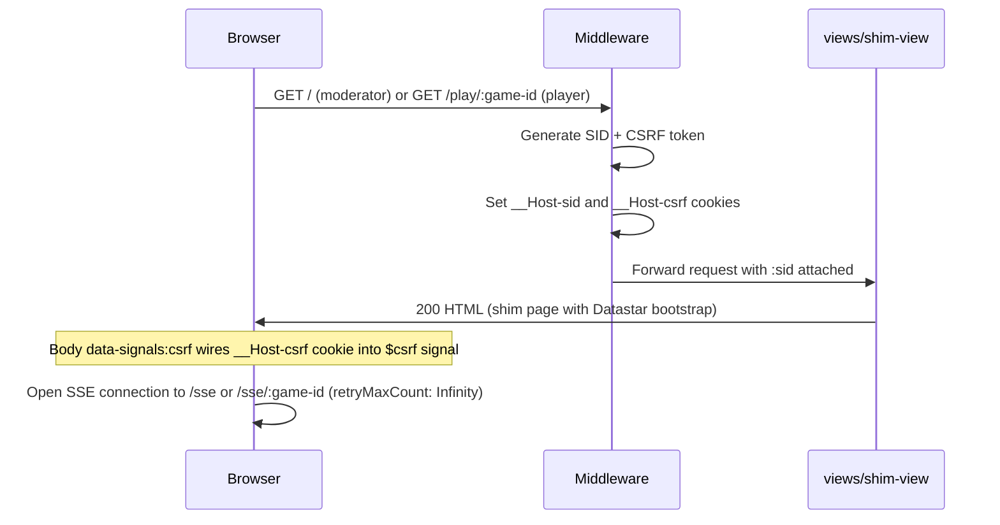
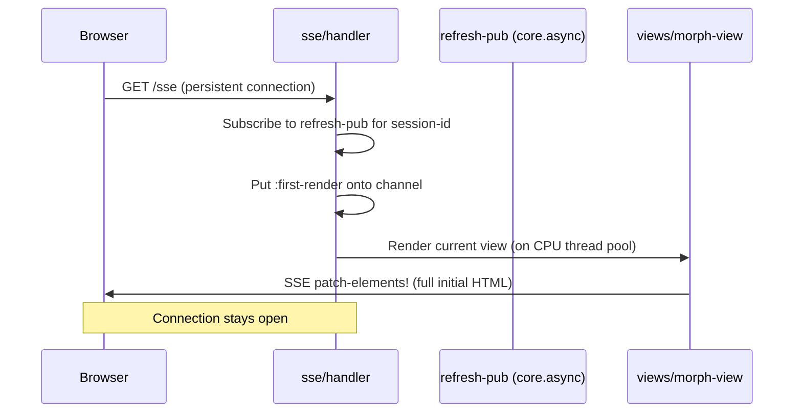
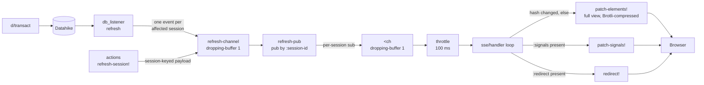
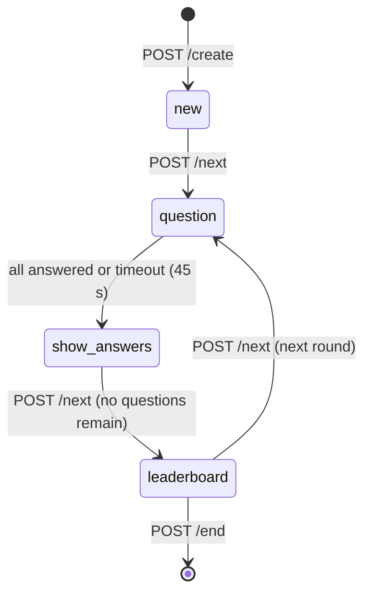
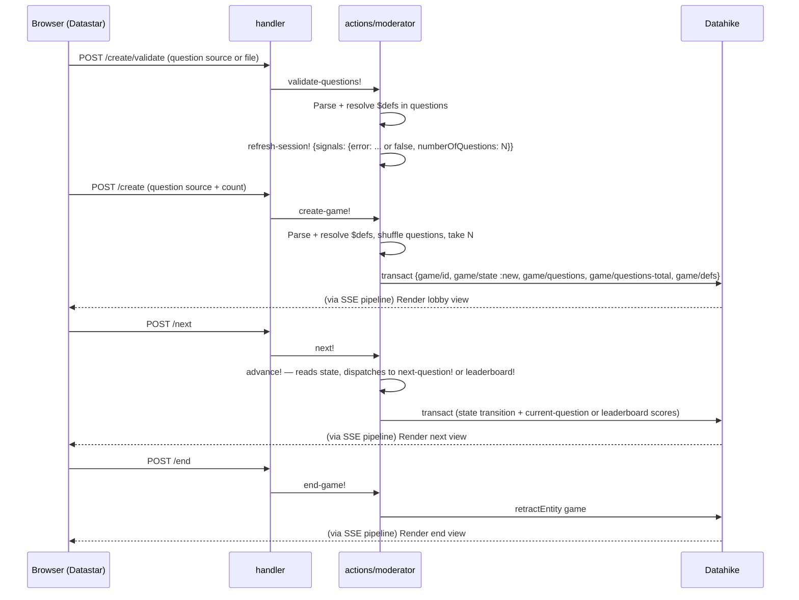
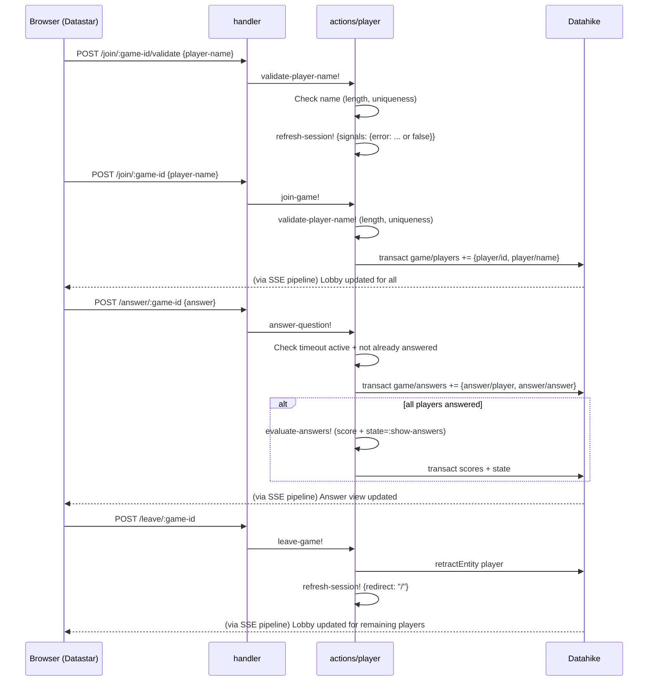
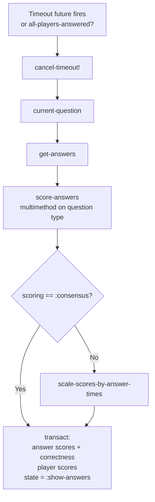
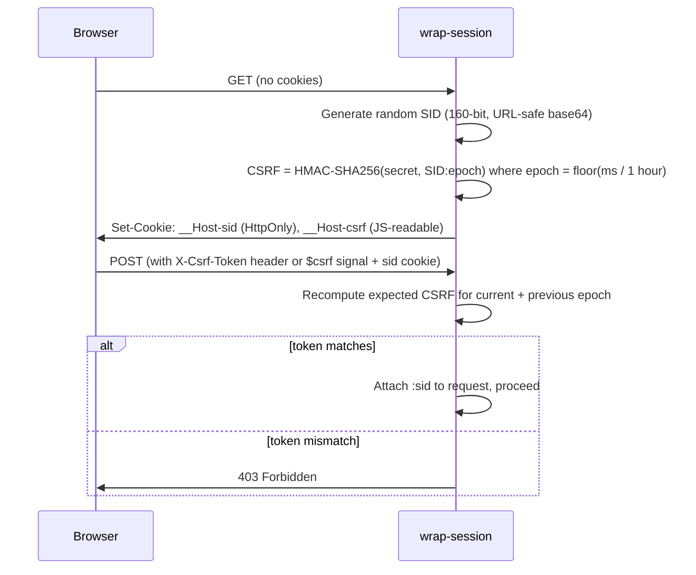

# Data flow

## Design summary

localquiz is a **server-driven, real-time multiplayer quiz** with a strictly **unidirectional data flow**: actions travel client → server via HTTP POST; view updates travel server → client via SSE. These are two separate one-way channels — the server never requests anything from a client, and all domain state lives exclusively on the server in Datahike. Clients hold only **[Datastar reactive signals](https://data-star.dev/guide/reactive_signals)** — `$`-prefixed variables that automatically track and propagate changes to any HTML expression that references them. Signals cover ephemeral UI state (form values, loading indicators, dialog references), server-pushed feedback (`$error`, `$numberOfQuestions`), and user preferences (`$language`, `$_cookieAccepted`). The server can patch signals directly over SSE (`patch-signals!`) without regenerating the full view HTML and morphing the DOM, and the client can mutate them through `data-bind` and `data-on` event handlers.

**Two roles:**

- **Moderator** — identified by session ID, which doubles as the game ID. Controls quiz progression.
- **Player** — identified by session ID; associated with a game via the game ID in the URL path.

**Four data paths:**

1. **Initial page load** — server issues a session cookie and CSRF token, returns a minimal shim HTML page with the Datastar runtime. The shim immediately opens an SSE connection; all UI content arrives via that stream.

2. **SSE view-update path** — every Datahike transaction triggers `db_listener`, which identifies all affected session IDs (the game's moderator and every current player) and publishes a refresh event per session ID onto `refresh-channel`. Each connected SSE handler is subscribed by its own session ID, receives the event, generates the **full view** HTML on a CPU thread pool, hashes it, and sends it via `patch-elements!` if the hash changed. Datastar morphs the received HTML into the existing DOM client-side (fat-morph approach — no server-side diffing or partial fragments). If view rendering detects a player is no longer in the game, it calls `refresh-session!` to redirect that session instead of rendering.

3. **Direct signal/redirect path** — actions that need per-session feedback (validation errors, redirect after leaving) call `refresh-session!`, which puts an event with the session ID and a payload (`{:signals …}` or `{:redirect …}`) directly onto `refresh-channel`.

4. **State machine** — the game progresses through `:new → :question → :show-answers → :leaderboard` and back (or terminates). State transitions are triggered by a single `POST /next` action; the `:show-answers` transition fires automatically when all players answer or the 45-second timeout expires.

**CQRS:** the architecture follows Command Query Responsibility Segregation. Commands (HTTP POST → `actions/` → `d/transact`) mutate state and return HTTP 204 — no view data. Queries (DB listener → SSE → `views/`) read state and produce HTML; they never mutate. The `refresh-session!` path carries per-session command acknowledgements (validation errors, redirects) and is exclusively triggered by client commands — never by server-initiated processes. Server-initiated state changes (question timeout, idle-game sweeper) go through `d/transact` and are reflected on the query side via the same DB listener → SSE pipeline.

**Brotli gate:** `wrap-blocker` rejects all requests that do not accept Brotli (`br`) with HTTP 406.

---

## Contrast with SPAs

The dominant paradigm for interactive web applications is the **single-page application (SPA)** with a virtual DOM (React, Vue, Svelte). localquiz deliberately inverts most of its assumptions.

| Axis | SPA / virtual DOM | localquiz |
|---|---|---|
| **State location** | Client — component state, Redux, Zustand, etc. | Domain state on the server (Datahike); clients hold only Datastar signals for ephemeral UI state, server-pushed feedback, and user preferences |
| **Rendering** | Client renders via JavaScript; virtual DOM diffing patches the real DOM | Server renders HTML (Hiccup/Chassis); full view HTML is sent over SSE |
| **DOM reconciliation** | Virtual DOM diff computed in the browser (React reconciler, Vue reactivity) | Datastar morphs server-sent HTML into the live DOM — no virtual DOM |
| **Data flow** | Bidirectional: client fetches JSON, mutates local state, re-renders | Unidirectional: client POSTs actions, server pushes HTML — two separate one-way channels |
| **Multi-client sync** | Each client owns its state; real-time sync requires additional infrastructure (WebSockets, state merging, conflict resolution) | All clients are kept in sync automatically — every DB change is fanned out to all connected SSE streams |
| **Client-side logic** | Application logic lives in the browser JS bundle | No application logic in the browser — the Datastar runtime provides declarative reactivity via signals; UI behaviour is expressed as HTML attributes, not JS code |
| **Reactivity model** | Front-end: a state change in the browser (e.g. Redux dispatch, `setState`) triggers a reconciliation cycle within the client; the server is a passive data source | Back-end: a Datahike transaction is the reactive event — `db_listener` subscribes to transactions and fans changes out to all connected SSE streams; clients are passive receivers |

**Consequences of moving state to the server:**

- An entire class of client-side bugs disappears: stale caches, optimistic update rollbacks, race conditions between concurrent fetches and renders, and state divergence between clients are structurally impossible.
- The fat-morph approach nominally trades per-update payload size (full view HTML rather than a minimal JSON delta) for the elimination of a client-side state model. In practice the concern is largely neutralised by [Brotli compression over SSE](https://andersmurphy.com/2025/04/15/why-you-should-use-brotli-sse.html): because successive frames share nearly identical HTML structure, Brotli's large context window (up to 263 KB, vs. gzip's fixed 32 KB) can reference prior frames, yielding compression ratios of 30:1–250:1 for repetitive HTML streams — far beyond what a hand-crafted JSON delta would achieve. This is why `wrap-blocker` requires Brotli support and why the SSE handler compresses each `patch-elements!` frame. The hash check additionally ensures no redundant frames are emitted at all.
- Real-time multiplayer consistency is trivial: because every player's view is derived from the same DB value on each SSE tick, players are always looking at the same game state without any client-side reconciliation.

**Trade-off:** every view update requires a server round-trip. The design is unsuitable for purely offline use or interactions that demand sub-millisecond local feedback (e.g. canvas drawing, real-time text editing). It is well suited to turn-based or event-driven flows — exactly the quiz game model.

---

## Roles

- **Moderator** — the quiz host. Identified by their session ID, which doubles as the game ID.
- **Player** — a participant. Identified by their session ID; associated with a game via the game ID in the URL path.

---

## 1. Initial page load

The shim page contains no game content — just the Datastar runtime and a `data-init` attribute that immediately opens the SSE connection. All content arrives via SSE. The `$csrf` signal is initialised from the `__Host-csrf` cookie by a JS expression on the `<body>` element. The connection is also re-opened on the `online` window event.

---

## 2. SSE connection and first render

The SSE handler keeps a virtual thread looping on a throttled channel (≤ 1 update per 100 ms). View rendering is offloaded to a CPU thread pool. The handler hashes the rendered HTML and only sends an update when the hash changes — using Datastar's **fat-morph** approach: the full view HTML is sent each time and Datastar morphs it into the existing DOM client-side, so the server never diffs or produces partial fragments. A `<cancel>` poison-pill channel is used to stop the loop and close all associated channels when the client disconnects.

---

## 3. Real-time update pipeline

Every database transaction and every direct `refresh-session!` call flow through this pipeline. The SSE handler branches on the event payload: signals → `patch-signals!`, redirect → `redirect!`, neither → full view render.

**DB listener detail:** `find-updated-sessions` queries `db-after` (for additions) and `db-before` (for retractions) to find session IDs for all affected sessions: the moderator (via `:game/id`) and all current players (via `:player/id`). It publishes `{:session-id sid}` for each. This means one transaction fans out to N separate channel puts — one per connected session.

---

## 4. Game state machine

The moderator advances the game via a single `POST /next` endpoint. `game/advance!` reads the current game state and dispatches to the appropriate transition function via the `transitions` map (`{:new next-question!, :show-answers leaderboard!, :leaderboard next-question!}`). The `:question → :show-answers` transition is never triggered by `POST /next`; it fires only when all players have answered or the timeout elapses.

---

## 5. Moderator actions

**`$defs`:** question EDN files may declare a top-level `:defs` map of named values. References to those names in question fields are resolved at parse time (`qs/resolve-refs`). The resolved `defs` are stored in the DB as `:game/defs` component entities so that `current-question` can re-resolve references when reading questions back.

---

## 6. Player actions

**Auto-redirect on disconnect:** `morph-view` checks on every view render whether the player is still in the game. If the game has already started (state ≠ `:new`) and the player's entity is gone, it calls `refresh-session!` with `{:redirect "/"}` to redirect that session — so the leaving player is redirected even if the `POST /leave` response races with a concurrent DB update.

---

## 7. Answer evaluation

Triggered either when all players answer or when the 45-second timeout fires. For `:consensus` scoring, answer times do not affect the score, so `scale-scores-by-answer-times` is skipped.

---

## 8. Session and CSRF flow

The CSRF token is valid for the current and the preceding 1-hour epoch, giving a validity window of up to two hours. It can be sent either as an `X-Csrf-Token` HTTP header or as the `$csrf` Datastar signal (accepted from `signals` map). The `__Host-csrf` cookie is not `HttpOnly` so that client-side JS can read it into the Datastar signal store on page load.
